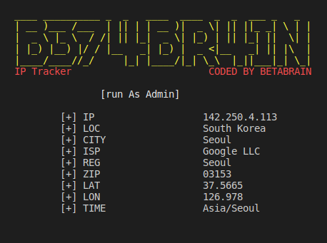

# IP_Tracker
```simple python snippet to get details about a domain or ip```

**REQUIRES YOU To INSTALL REQUESTS MODULE, Command: pip install requests**
>Usage: sudo python3 tracker.py --ipaddress google.com


